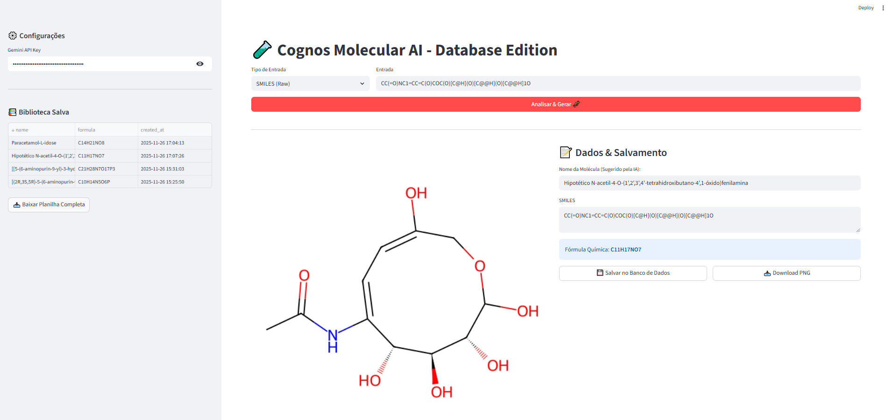
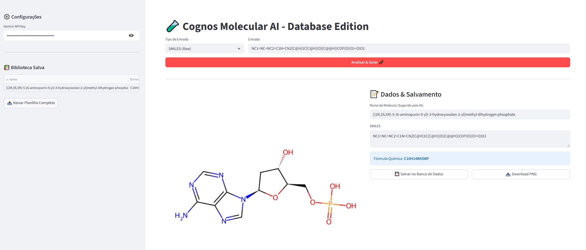
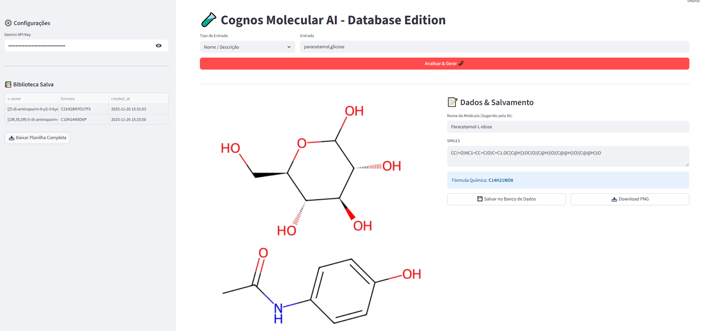
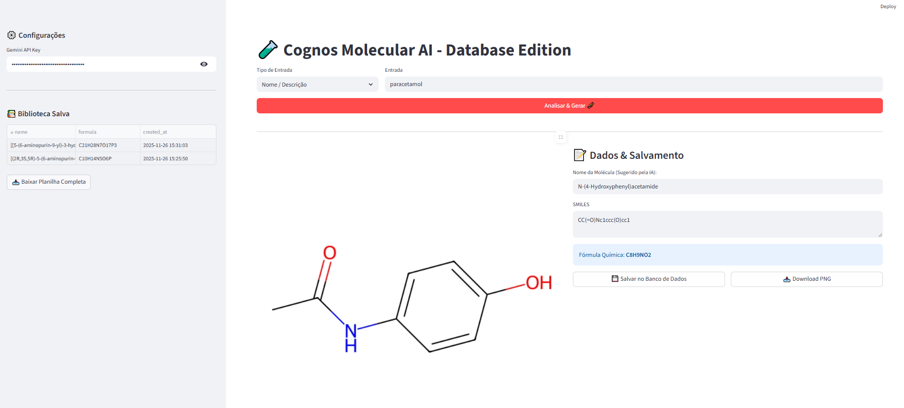

<div align="center">

# 🧪 Cognos Molecular AI
### Database Edition
**Faça uma doação** 21980892973
**Explore, Gere e Catalogue Moléculas com o poder da IA Generativa e RDKit.**


[Funcionalidades](#-funcionalidades) • [Instalação](#-instalação) • [Como Usar](#-como-usar) • [Screenshots](#-galeria)

---
</div>

## 📖 Sobre o Projeto https://cognos-molecular.streamlit.app/

**Cognos Molecular AI** é uma ferramenta de quimioinformática desenvolvida para bridging a lacuna entre descrições textuais e estruturas químicas precisas. Utilizando **Google Gemini 3.0**, o sistema interpreta entradas complexas ou teóricas e as converte em estruturas visuais (SMILES), permitindo salvar, catalogar e exportar sua própria biblioteca molecular.

Seja para estudantes testando estruturas hipotéticas ou pesquisadores organizando compostos, o Cognos oferece uma interface visual limpa e persistência de dados local.

## 🚀 Funcionalidades

* **🧬 Renderização Molecular Avançada:** Visualização 2D de alta qualidade usando RDKit.
* **🤖 Inteligência Artificial Híbrida:**
    * Converte texto natural ("Paracetamol", "Molécula com 3 anéis...") em SMILES.
    * **Nomenclatura Criativa:** A IA analisa a estrutura desenhada e sugere um nome científico plausível (IUPAC ou descritivo) para moléculas que não existem oficialmente.
* **🛠️ Tratamento de Erros (Modo Nuclear):** Algoritmos de limpeza automática para corrigir SMILES inválidos ou remover anéis quebrados.
* **💾 Banco de Dados Local:** Sistema SQLite integrado para salvar seu histórico com data, nome e fórmula.
* **📥 Exportação:** Download de imagens (PNG) e da biblioteca completa (CSV).

## 📸 Galeria

| Interface Principal | Detalhes da Molécula |
|:---:|:---:|
| <br>_Visão geral da interface e geração de estruturas hipotéticas_ | <br>_Renderização de fosfatos e estruturas complexas_ |

| Biblioteca & Histórico | Entrada Simples |
|:---:|:---:|
| <br>_Gerenciamento de banco de dados e downloads_ | <br>_Reconhecimento rápido por nome comum_ |

## 📦 Instalação

Siga os passos abaixo para configurar o ambiente:

```bash
# 1. Clone o repositório
git clone [https://github.com/seu-usuario/cognos-molecular.git](https://github.com/seu-usuario/cognos-molecular.git)
cd cognos-molecular

# 2. Crie um ambiente virtual (Opcional, mas recomendado)
python -m venv venv
# Windows:
venv\Scripts\activate
# Linux/Mac:
source venv/bin/activate

# 3. Instale as dependências
pip install streamlit rdkit cirpy google-generativeai pandas

⚙️ Configuração da API
Para utilizar os recursos de IA (Interpretação de texto e Nomenclatura), você precisa de uma chave de API do Google Gemini:

Gere sua chave em Google AI Studio.

Inicie a aplicação.

Insira a chave na barra lateral no campo "Gemini API Key".

Nota: A aplicação funciona em modo "Offline" (apenas SMILES exatos e Cirpy) sem a chave, mas a "magia" da interpretação de texto será desativada.

▶️ Execução
Bash

streamlit run Cognos-Molecular.py
O navegador abrirá automaticamente em http://localhost:8501.

🛠️ Tech Stack
Frontend: Streamlit

Química: RDKit & Cirpy

AI Core: Google Generative AI SDK

Data: SQLite3 & Pandas

🤝 Contribuição
Contribuições são bem-vindas! Sinta-se à vontade para abrir issues ou enviar PRs.

Faça um Fork do projeto

Crie sua Feature Branch (git checkout -b feature/AmazingFeature)

Commit suas mudanças (git commit -m 'Add some AmazingFeature')

Push para a Branch (git push origin feature/AmazingFeature)

Abra um Pull Request

📝 Licença
Distribuído sob a licença MIT. Veja LICENSE para mais informações.

<div align="center"> <sub>Desenvolvido com ☕ e Python.</sub> </div>
